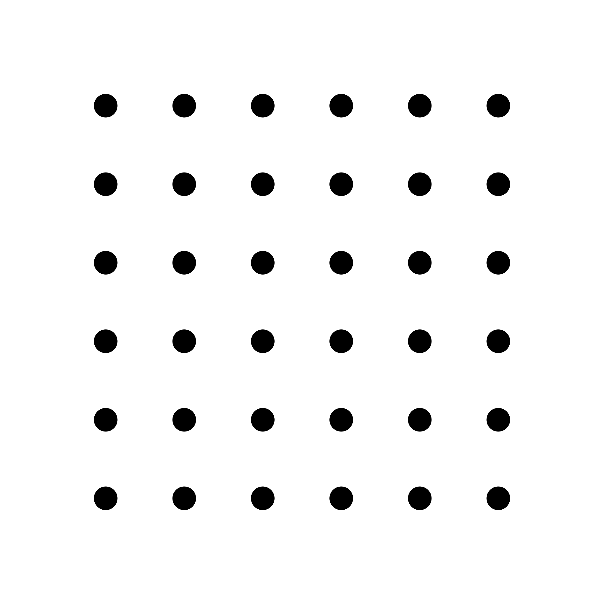
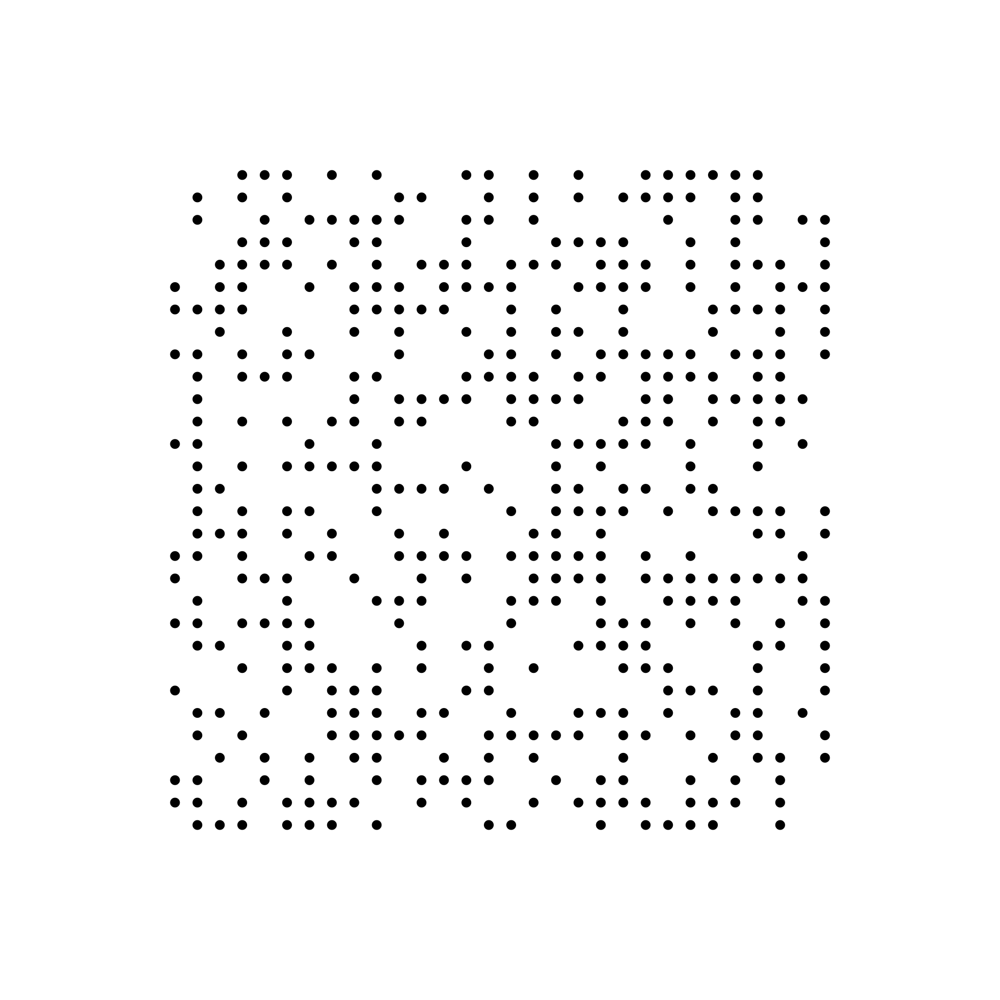
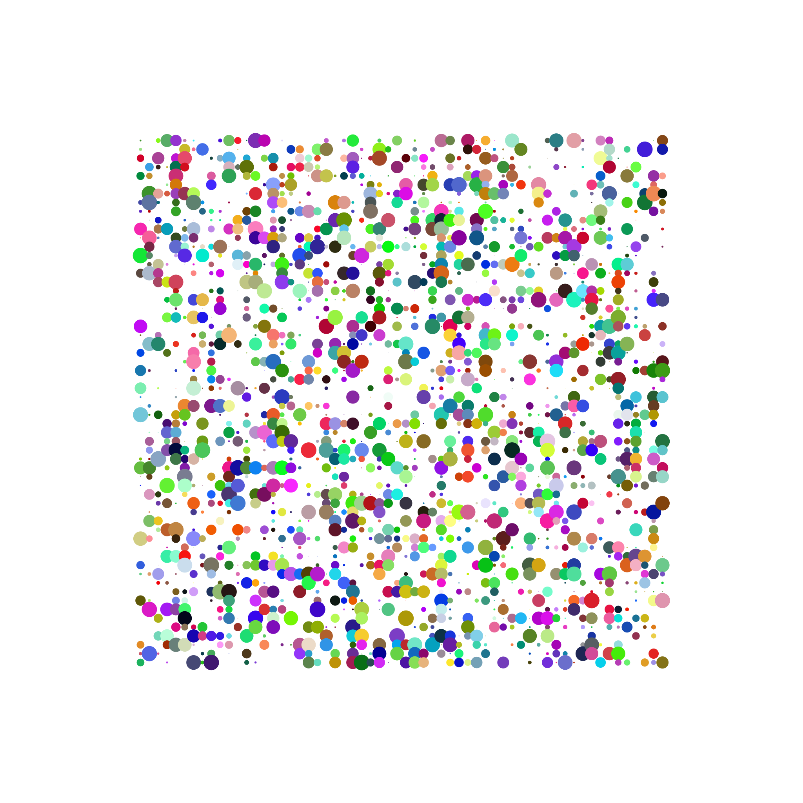

## canvas 生成一些有趣的图形
* [缘由](https://github.com/mattdesl/workshop-generative-art)
* 依赖 canvas-sketch 和 canvas-sketch-cli

## 记录
* [生成一个网格圆点](./src/grid.js)  

* [随机点阵](./src/grid-random.js)  

* [随机位置/颜色/大小点图](./src/grid-picture.js)  
